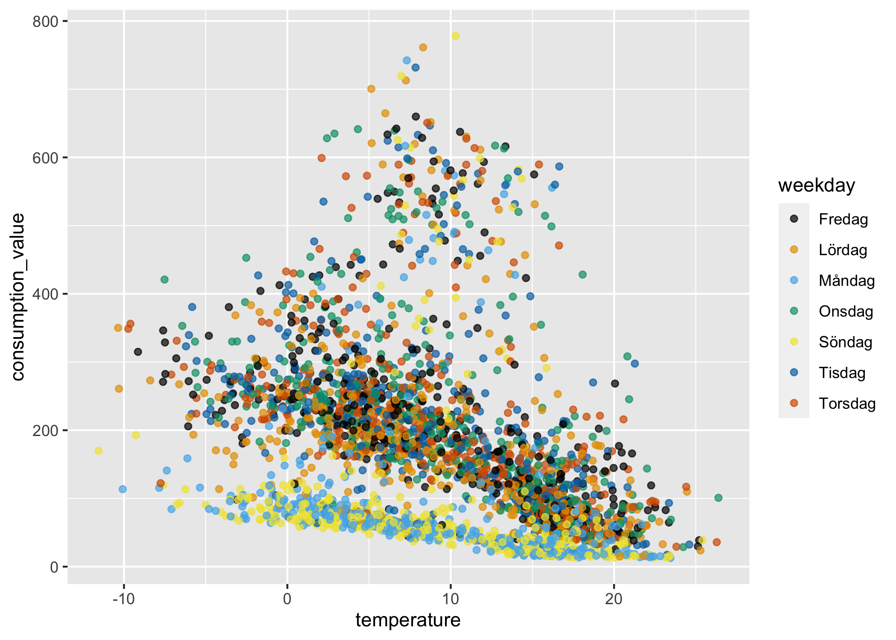
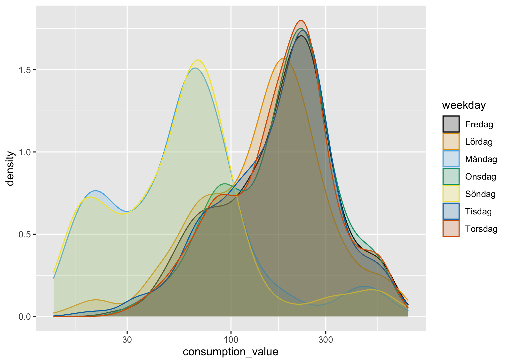

Hey Arnold
================
Filip Wästberg
2020-10-21

I en tidigare Notebook introducerade vi en alternativ algoritm till K2.
Den heter `arnold` och är byggd på ett modellramverk som heter
`Generalized Additive Models (GAM)`. Modellen funkar på ungefär samma
sätt som K2s nuvarande algoritm. Men istället för att anpassa en bruten
linjär regression anpassar vi med hjälp av `GAM` *en* regressionslinje,
som inte är linjär. Utöver det använder vi också en mer standardiserade
metod än *standardavvikelsen* (som används i K2 idag) för att
identifiera larm, den heter `Inter Quartile Range (iqr)`.

Men i vår förra Notebook utgick vi från ganska enkel data. Nu är vi
nyfikna på hur den här algoritmen fungerar på fjärrvärmeanvändning som
driftar. Ett av skälen till att vi i K2 använder *referensdata* är att
vi ska kunna upptäcka fjärrvärmeanvändning som driftar, så en ny
algoritm måste kunna upptäcka det. En annan aspekt som `arnold` behöver
kunna hantera är att det finns flera effektsignaturer. Ofta beror det
här på olika användning under olika veckodagar.

Vi kommer utgå från ett exempeldata där en drift av flöde uppstår:

``` r
library(tidyverse)
filer <- list.files("data") %>% 
  paste0("data/", .) %>% 
  set_names()

tds2 <- read_delim(filer[[1]], delim = ";")
tds5 <- read_delim(filer[[2]], delim = ";")
tds9 <- read_delim(filer[[3]], delim = ";")

tds2 <- tds2 %>% 
  mutate_all(~str_replace(., ",", ".")) %>% 
  mutate_at(vars(value, consumption_value, temperature), as.numeric)

tds5 <- tds5 %>% 
  mutate_all(~str_replace(., ",", ".")) %>% 
  mutate_at(vars(value, consumption_value, temperature), as.numeric)

tds9 <- tds9 %>% 
  mutate_all(~str_replace(., ",", ".")) %>% 
  mutate_at(vars(value, consumption_value, temperature), as.numeric)

data <- bind_rows(tds2, tds5, tds9) %>% 
  filter(consumption_value > 0) %>% 
  mutate(consumption_from = as.Date(consumption_from))

tds5 <- data %>% 
  filter(metering_point_id == "TDS5" & property == "flow") 

tds5%>% 
  ggplot(aes(consumption_from, consumption_value)) +
  geom_point() +
  geom_smooth(method = "gam", color = "orange") +
  theme_minimal() +
  labs(
    title = "Driftande flöde"
  )
```

<!-- -->

Vi ser det här i effektsignaturen också:

``` r
tds5%>% 
  ggplot(aes(temperature, consumption_value)) +
  geom_point() +
  geom_smooth(method = "gam", color = "orange") +
  theme_minimal() +
  labs(
    title = "Driftande flöde"
  )
```

<!-- -->

Vi ser att det finns två olika effektsignaturer i diagrammet. Just den
här typen kallas ofta för “tvåstråkare”. K2 identiferar de två stråken
genom att anpassa en bruten regressionslinje på hela datasettet och
delar sedan in data i två grupper: de som är under linjen och de som är
över linjen. Den anpassar sedan en ny bruten regression till respektive
grupp och itererar. Det här finns utförligt beskrivet i en Notebook av
Ida Lundholm Benzi på Data Science-portalen.

``` r
tds5_ref <- tds5 %>% 
  mutate(temp_interval = cut(temperature, c(-Inf, 2, 9, 15, 20, Inf)),
         period = if_else(timestamp < "2014-01-01", "referensperiod", "testperiod")) %>% 
  filter(period == "referensperiod")

tds5_ref %>% 
  ggplot(aes(temperature, consumption_value, color = temp_interval)) +
  geom_point(alpha = 0.2) +
  geom_smooth(method = "lm") +
  theme_minimal() +
  labs(
    title = "K2 på referensdata"
  )
```

<!-- -->

`arnold` hanterar det här annorlunda. Istället för att identifiera
grupperna i effektsignaturen utgår den från att det här i regel beror på
olika konsumtion under olika dagar.

``` r
library(ggthemes)
tds5 <- tds5 %>% 
  mutate(weekday = weekdays(consumption_from))

tds5 %>% 
  ggplot(aes(temperature, consumption_value, color = weekday)) +
  geom_point(alpha = 0.7) +
  scale_color_colorblind()
```

<!-- -->

Vi kan visualisera skillnaden mellan dagar:

``` r
tds5 %>% 
  group_by(weekday) %>% 
  summarise(median_consumption = median(consumption_value)) %>% 
  ggplot(aes(median_consumption, weekday, fill = weekday)) +
  geom_col() +
  theme(legend.position = "none") +
  scale_fill_colorblind()
```

<!-- -->

Vi kan även kolla fördelningen, där vi ser att söndag och måndag har i
princip samma fördelning, medan alla andra dagar förutom lördag har i
princip samma fördelning.

``` r
tds5 %>% 
  ggplot(aes(consumption_value, color = weekday, fill = weekday)) +
  geom_density(alpha = 0.2) +
  scale_color_colorblind() +
  scale_fill_colorblind()
```

<!-- -->

Linjärt test för tds5

``` r
library(mgcv)
test <- lm(log10(consumption_value) ~ weekday, data = tds5)

summary(test)
```

    ## 
    ## Call:
    ## lm(formula = log10(consumption_value) ~ weekday, data = tds5)
    ## 
    ## Residuals:
    ##      Min       1Q   Median       3Q      Max 
    ## -0.99506 -0.20860  0.04094  0.17738  1.14316 
    ## 
    ## Coefficients:
    ##                 Estimate Std. Error t value Pr(>|t|)    
    ## (Intercept)     2.237895   0.015047 148.723  < 2e-16 ***
    ## weekdayLördag  -0.072571   0.021268  -3.412 0.000653 ***
    ## weekdayMåndag  -0.488630   0.021268 -22.975  < 2e-16 ***
    ## weekdayOnsdag   0.011103   0.021255   0.522 0.601438    
    ## weekdaySöndag  -0.489960   0.021268 -23.038  < 2e-16 ***
    ## weekdayTisdag  -0.005422   0.021242  -0.255 0.798543    
    ## weekdayTorsdag  0.006577   0.021268   0.309 0.757136    
    ## ---
    ## Signif. codes:  0 '***' 0.001 '**' 0.01 '*' 0.05 '.' 0.1 ' ' 1
    ## 
    ## Residual standard error: 0.3076 on 2928 degrees of freedom
    ## Multiple R-squared:  0.333,  Adjusted R-squared:  0.3316 
    ## F-statistic: 243.6 on 6 and 2928 DF,  p-value: < 2.2e-16

linjärt test för tds9

``` r
tds9 %>% 
  mutate(weekday = weekdays(as.Date(consumption_from))) %>% 
  filter(property == "energy") %>% 
  lm(consumption_value ~ weekday, data = .) %>% 
  summary()
```

    ## 
    ## Call:
    ## lm(formula = consumption_value ~ weekday, data = .)
    ## 
    ## Residuals:
    ##      Min       1Q   Median       3Q      Max 
    ## -2.01900 -1.14145  0.02575  0.93748  2.59306 
    ## 
    ## Coefficients:
    ##                 Estimate Std. Error t value Pr(>|t|)    
    ## (Intercept)     2.114250   0.085273  24.794   <2e-16 ***
    ## weekdayLördag  -0.012803   0.120784  -0.106    0.916    
    ## weekdayMåndag   0.082688   0.120594   0.686    0.493    
    ## weekdayOnsdag  -0.005885   0.120784  -0.049    0.961    
    ## weekdaySöndag   0.024438   0.120594   0.203    0.839    
    ## weekdayTisdag   0.008266   0.120784   0.068    0.945    
    ## weekdayTorsdag -0.015250   0.120594  -0.126    0.899    
    ## ---
    ## Signif. codes:  0 '***' 0.001 '**' 0.01 '*' 0.05 '.' 0.1 ' ' 1
    ## 
    ## Residual standard error: 1.079 on 1110 degrees of freedom
    ## Multiple R-squared:  0.0008641,  Adjusted R-squared:  -0.004537 
    ## F-statistic:  0.16 on 6 and 1110 DF,  p-value: 0.987
